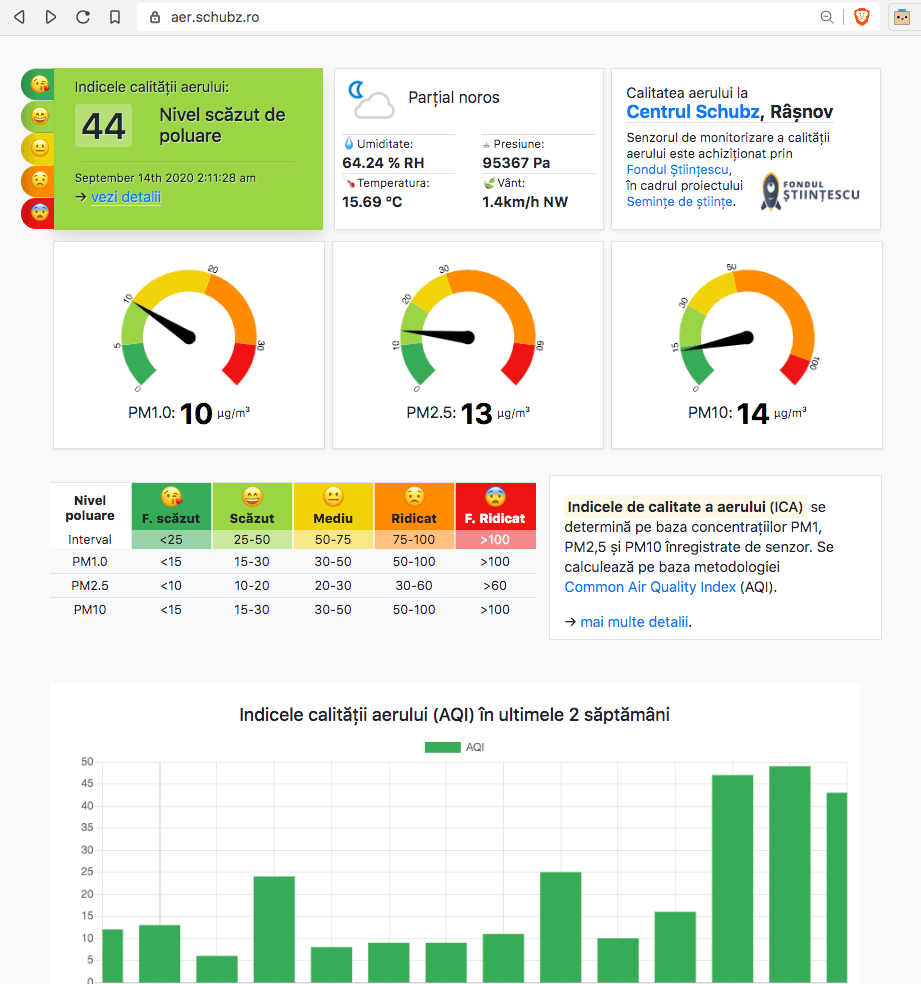
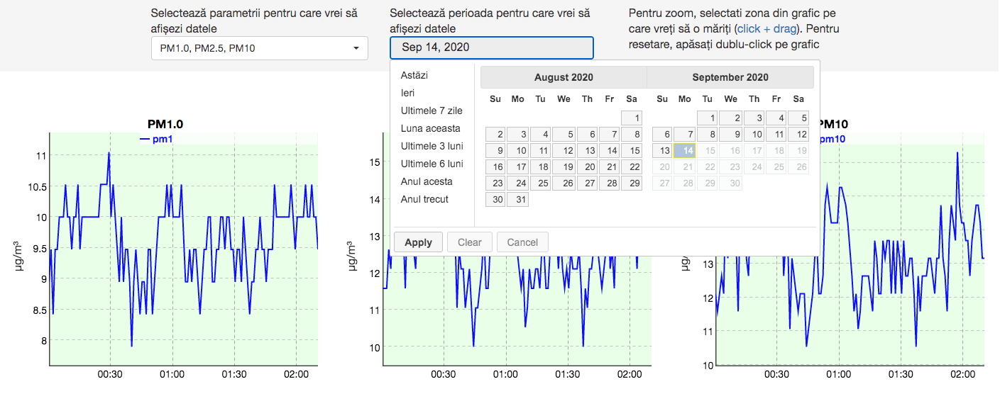

# uRADMonitorGraphs

Proof-of-Concept implementation for uRADMonitor API

[aer.schubz.ro](https://aer.schubz.ro/) 

Js Libraries
- moment.js
- dyngraphs.js
- jquery.comiseo.daterangepicker.js 
- jquerry-ui.js
- chart.js
- gauge.js