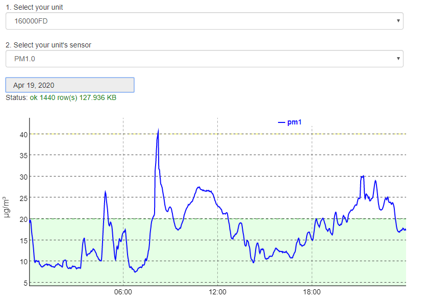

# uRADMonitorGraphs

<b>Proof-of-Concept implementation for uRADMonitor API </b>
  

 
<ul>
 Js Libraries
   <li>moment.js</li>
   <li>dyngraphs.js</li>
   <li>jquery.comiseo.daterangepicker.js </li>
   <li>jquerry-ui.js</li>
   <li>chart.js</li>
   <li>gauge.js</li>
<ul/>
